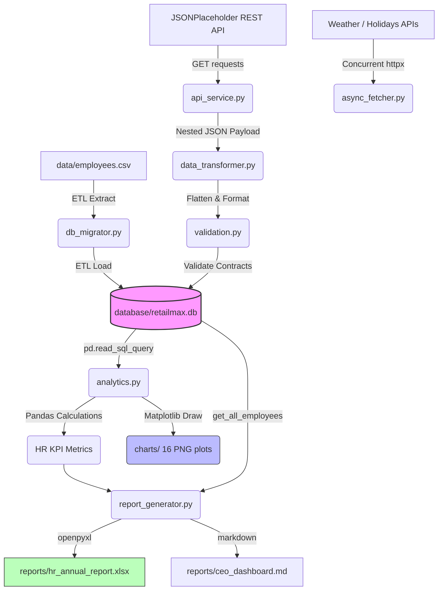

# RetailMax Enterprise Data Platform (v6.0)

Welcome to the **RetailMax Enterprise Data Platform** onboarding repository. This project is structured as a professional, production-ready software engineering workspace designed to train software engineer onboarding classes on core Python development, database persistence, data validation, business intelligence, asynchronous concurrency, and unit testing.

The platform is designed to show the growth of a software application from a single flat CSV file (Phase 1) up to a fully modularized, multi-layered data ingestion and analytics pipeline (Phase 5).

---

## 🏗️ System Architecture & Data Flow

The platform ingests records from both historical databases (baseline CSV) and live external systems (REST JSON API), processes them through strict verification contracts, stores them in a relational database, and runs data engineering pipelines to output executive spreadsheets and charts.



---

## 📁 Project Structure

```text
RetailMax/
│
├── employee.py                # Employee domain model & field validations
├── csv_handler.py             # Flat-file database operations (Atomic write CRUD)
├── database.py                # SQLite database layers, schemas & SQL CRUD
├── db_migrator.py             # CSV-to-SQLite ETL migration coordinator
│
├── api_service.py             # REST API Client with resilient offline fallbacks
├── async_fetcher.py           # asyncio concurrent fetches (httpx)
├── data_transformer.py        # JSON flattening and type normalizer
├── validation.py              # Vectorized DataFrame split validation (data contracts)
│
├── analytics.py               # Pandas analytics & 16 Matplotlib charts engine
├── report_generator.py        # OpenPyXL styled workbook builder & MD Dashboard
│
├── config.py                  # Absolute path resolution & folders initialization
├── constants.py               # Global whitelists, error codes, and tax rates
├── exceptions.py              # Project-specific exceptions hierarchy
├── logging_config.py          # Rotating file & stream logger configurations
├── main.py                    # Lightweight orchestrator entry point
│
├── data/
│   └── employees.csv          # Source baseline dataset (110 records)
├── database/
│   └── retailmax.db           # Target SQLite database (runtime generated)
├── charts/                    # Target directory for 16 generated PNG plots
├── reports/                   # Target directory for MD and Excel summaries
│
├── tests/                     # Automated testing suite
│   ├── __init__.py
│   ├── test_employee.py       # Domain model validations tests
│   ├── test_database.py       # SQL queries & transaction rollback tests
│   ├── test_validation.py     # Regex and split-validation tests
│   ├── test_analytics.py      # Pandas metrics & Matplotlib exports tests
│   ├── test_api.py            # API mocking & fallback tests
│   ├── test_transformer.py    # Payload flattening tests
│   └── test_integration.py    # End-to-end integration tests
│
├── requirements.txt           # Dependencies list
├── pyproject.toml             # Ruff, Black, and Mypy static check controls
├── LICENSE                    # MIT License
└── README.md                  # Developer manual
```

---

## 🚀 Getting Started

### 1. Prerequisite Installations

Ensure you have Python 3.10+ installed. Clone or copy the repository to your environment, and install dependencies:

```bash
pip install -r requirements.txt
```

### 2. Run the ETL Pipeline Orchestrator

Execute the pipeline using python:

```bash
python main.py
```

#### Expected Terminal Output:
```text
[2026-07-09 21:50:02,123] [INFO    ] [orchestrator:run_pipeline:23] - Initializing RetailMax Enterprise ETL Pipeline...
[2026-07-09 21:50:02,154] [INFO    ] [db_migrator:migrate:32] - === Starting Database Migration ETL Process ===
[2026-07-09 21:50:02,160] [INFO    ] [db_migrator:migrate:48] - Extracting records from CSV source: C:\Users\Himanshu Sardana\...\data\employees.csv
[2026-07-09 21:50:02,204] [INFO    ] [csv_handler:read_all:74] - Read 110 valid employees from CSV.
[2026-07-09 21:50:02,210] [INFO    ] [db_migrator:migrate:63] - Cleaned target database table 'employees' for clean migration.
[2026-07-09 21:50:02,225] [INFO    ] [database:insert_employees_batch:198] - Successfully batch inserted 110 employees to database.
[2026-07-09 21:50:02,228] [INFO    ] [db_migrator:migrate:72] - === Migration Successful! Migrated 110 employees in 0.074s ===
[2026-07-09 21:50:02,230] [INFO    ] [orchestrator:run_pipeline:30] - Baseline loaded: 110 employees in 0.076s.
[2026-07-09 21:50:02,231] [INFO    ] [api_service:fetch_raw_employees:44] - Ingesting raw employees via API: https://jsonplaceholder.typicode.com/users
[2026-07-09 21:50:02,890] [INFO    ] [api_service:fetch_raw_employees:58] - Successfully fetched 10 users from API.
[2026-07-09 21:50:02,901] [INFO    ] [data_transformer:transform_raw_payload:25] - Starting transformation of 10 raw user payloads.
[2026-07-09 21:50:02,940] [INFO    ] [data_transformer:transform_raw_payload:83] - DataFrame Transformation complete: Generated 10 Employee instances.
[2026-07-09 21:50:02,954] [INFO    ] [database:insert_employees_batch:198] - Successfully batch inserted 10 employees to database.
[2026-07-09 21:50:02,956] [INFO    ] [orchestrator:run_pipeline:39] - Merged 10 external API records to database.
[2026-07-09 21:50:02,957] [INFO    ] [async_fetcher:fetch_all_feeds_concurrently:53] - Starting concurrent async execution of all data feeds...
[2026-07-09 21:50:03,110] [INFO    ] [async_fetcher:fetch_all_feeds_concurrently:65] - Concurrent async aggregation complete. Elapsed: 0.153 seconds.
[2026-07-09 21:50:03,111] [INFO    ] [orchestrator:run_pipeline:44] - Concurrently checked 3 feeds in 0.154s.
[2026-07-09 21:50:03,112] [INFO    ] [analytics:load_cleaned_dataframe:27] - Loading dataset for Pandas analytics...
[2026-07-09 21:50:03,124] [INFO    ] [analytics:load_cleaned_dataframe:37] - Loaded 120 rows from SQLite Database.
[2026-07-09 21:50:03,130] [INFO    ] [analytics:load_cleaned_dataframe:72] - DataFrame cleaning and feature engineering complete.
[2026-07-09 21:50:03,131] [INFO    ] [analytics:calculate_kpis:82] - Calculating HR KPIs...
[2026-07-09 21:50:03,142] [INFO    ] [analytics:calculate_kpis:115] - KPI calculations finished.
[2026-07-09 21:50:03,143] [INFO    ] [analytics:generate_all_charts:126] - Beginning generation of 16 analytical charts...
[2026-07-09 21:50:04,550] [INFO    ] [analytics:generate_all_charts:386] - Successfully generated and saved all 16 Matplotlib charts.
[2026-07-09 21:50:04,551] [INFO    ] [orchestrator:run_pipeline:52] - Generated 16 analytical charts in 'charts/' directory.
[2026-07-09 21:50:04,552] [INFO    ] [report_generator:generate_ceo_markdown_dashboard:33] - Generating CEO Markdown Dashboard report...
[2026-07-09 21:50:04,561] [INFO    ] [report_generator:generate_ceo_markdown_dashboard:104] - Markdown dashboard generated at: reports\ceo_dashboard.md
[2026-07-09 21:50:04,562] [INFO    ] [report_generator:generate_excel_workbook:118] - Generating corporate Excel spreadsheet report...
[2026-07-09 21:50:04,710] [INFO    ] [report_generator:generate_excel_workbook:265] - Excel workbook report generated at: reports\hr_annual_report.xlsx
[2026-07-09 21:50:04,711] [INFO    ] [orchestrator:run_pipeline:61] - ETL Dashboard Report ready: reports\ceo_dashboard.md
[2026-07-09 21:50:04,712] [INFO    ] [orchestrator:run_pipeline:62] - Styled Excel Directory ready: reports\hr_annual_report.xlsx
[2026-07-09 21:50:04,712] [INFO    ] [orchestrator:run_pipeline:63] - === Pipeline Executed Successfully ===
```

---

## 🧪 Running Automated Tests

Run the full pytest suite (8 files, 25+ detailed assertions covering constraints, exceptions, mock APIs, and integrations):

```bash
pytest -v
```

---

## 💎 Code Quality Verification

This project enforces strict coding styles, imports sorting, lint checking, and static type configurations.

```bash
# 1. Formatting
black --check .

# 2. Linting and Imports
ruff check .

# 3. Static Type Verification
mypy .
```

---

## 📊 Visual Dashboard Outputs

When `main.py` is executed, 16 distinct plots are written to `charts/`. These include:
- `01_headcount_by_dept.png` (Headcounts by branch)
- `04_salary_distribution.png` (Salary Histograms)
- `05_salary_by_dept_boxplot.png` (Salary dispersion box plots)
- `08_hiring_trends_line.png` (Staff growth over time)
- `14_high_performers_by_dept.png` (Stacked performace ratios)
- `15_salary_violin_plot.png` (Violin probability distribution plot)
- `16_correlation_heatmap.png` (Metric correlation heatmap)

Open `reports/ceo_dashboard.md` in a Markdown viewer to see a complete aggregated dashboard reporting these KPIs and embedding links to these graphics. Open `reports/hr_annual_report.xlsx` in Excel or LibreOffice Calc to review the styled worksheets with autocomputed formulas.

---

## 🔮 Future Scope
- **SQL Databases Integration:** Migrate backend from SQLite to enterprise-level PostgreSQL.
- **REST Web Server:** Wrap the query engine inside a FastAPI endpoint to host live dashboards.
- **Task Orchestration:** Schedule daily runs of the database migrator via Apache Airflow DAGs.
- **Visual Frontend:** Build a modern UI dashboard using React or Streamlit.
